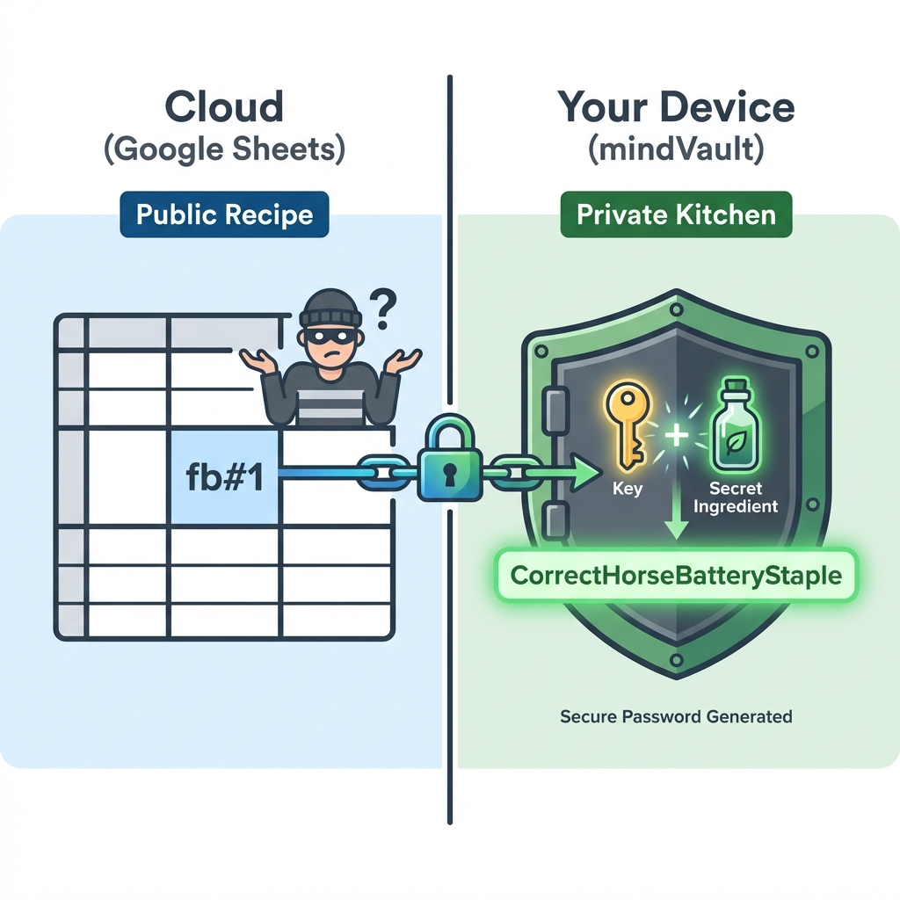

# mindVault Password Generator

**Turn Google Sheets into a Secure Password Manager**

> **Note:** This repository contains two projects:
>
> 1. **[Chrome Extension](./chrome-extension)**: The main password manager tool.
> 2. **[Landing Page](./landing-page)**: Marketing website.

mindVault is a Chrome Extension that allows you to generate strong, consistent passwords directly from your Google Sheets cells using a formula-based approach (e.g., `r4nd0m#1`). It uses **Argon2id** and **AES-256-GCM** to ensure your master secrets are secure.

## Why is this Safe? (Recipe vs. Cake)

> **Your Google Sheet can stay public. Your passwords stay private.**

### The Problem

Storing passwords in Google Sheets? You're one shared link away from disaster. But you keep doing it because it's convenient.

### The Better Way

What if you could keep using Google Sheets—without storing actual passwords?
We split your password into two parts:

- **Part 1 (Public)**: A simple formula you save in your sheet (`r4nd0m#1`)
- **Part 2 (Secret)**: A phrase only you remember (`Basic*`)

When you need to log in, mindVault combines them intelligently `using many different rules` you define. Your actual password never touches your sheet. If a hacker steals your Google Sheet, they only see a list of "Recipe Names". Without the Secret Ingredients (which never leave your device), they cannot bake the Cake (generate the password).

### Why It Works

**Same convenience**: Still using Google Sheets you already love
**Real security**: Hackers see formulas, not passwords. Worthless without your secret
**Future-proof**: Need to rotate passwords? Change one secret, update instantly across all accounts
**Peace of mind**: Your most sensitive data is never stored as plaintext

### The Math

```
What's on your sheet: `r4nd0m#1`
What you remember: `Basic*`
Your actual password: `Basic*r4nd0m`
```

_Simple formula. Unbreakable security._



## Features

- 🔐 **Zero-Knowledge**: Your master password and secrets never leave your device (stored encrypted in Chrome Sync).
- ⚡ **Instant Generation**: Click any cell with a formula (e.g., `fb#1`) to generate a password.
- ⌨️ **Hotkey Support**: Press `Ctrl+Shift+L` (or `Cmd+Shift+L` on Mac) to generate from the focused cell.
- 📋 **Auto-Clear Clipboard**: Passwords are automatically cleared from your clipboard after 30 seconds.
- 🔒 **Auto-Lock**: Automatically locks after 5 minutes of inactivity or 10 minutes total.
- 🌍 **Localization**: Supports English and **Vietnamese**.

                 |

## Core Documentations

- [Password System Design](./docs/password-system-design.md)
- [Product Requirements Document (PRD)](./docs/prd.md)
- [Security Assessment](./docs/security-assessment.md)

## Installation (Developer Mode)

1. **Clone or Download** this repository.
2. Open Chrome and navigate to `chrome://extensions/`.
3. Enable **Developer mode** (top right toggle).
4. Click **Load unpacked**.
5. Select the `src` folder inside `chrome-extension` (e.g., `./chrome-extension/src`).

## Usage

### 1. Setup

- Click the extension icon.
- Create a strong **Master Password**. This is used to encrypt your secret phrases.
- **Important**: If you lose this password, you lose access to your secrets. There is no reset.

### 2. Configure Secrets

- Enter up to 5 secret phrases corresponding to different modifiers:
  - `1` (Prefix `#`): e.g., "MySecretPrefix"
  - `2` (Middle `@`): e.g., "MySecretMiddle"
  - ...
- Save your changes.

### 3. Generate Passwords

- Open any Google Sheet.
- Type a formula into a cell, e.g., `fb#1` (Service: fb, Modifier: #, Secret Index: 1).
- **Click the cell** OR press `Ctrl+Shift+L`.
- A popup will appear with your generated password. Click **Copy**.

## Formula Syntax

`<Hash><Modifier><SecretIndex>[_Version]`

- **Hash**: Any text (e.g., `fb`, `google`, `bank`).
- **Modifier**:
  - `#`: Prefix Secret
  - `@`: Suffix Secret
  - `$`: Wrapper Secret
  - `%`: Interleaved Secret
  - `^`: Paired Secret
- **SecretIndex**: 1-5 (Which secret phrase to use).
- **Version** (Optional): `_v2`, `_v3` to rotate passwords.

Example: `gmail@2_v2`

## Development

- **Architecture**: Domain-Driven Design (DDD) with Clean Architecture.
- **Tech Stack**: Vanilla JS, Chrome Extensions Manifest V3.
- **Security**: Argon2 (WASM), Web Crypto API.
