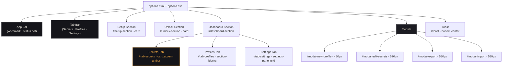

# Visual Explanation: Options Page Redesign (v1 → v2 Precision)

## Overview

The Options page has been converted from the v1 "GitHub-dark" design (blue accent, Outfit font, 620px, 12px radii) to the v2 "Precision" system (amber accent, Fraunces + Geist fonts, 760px, 4–8px radii, warm ink ramp).

---

## Quick View (ASCII) — Page Structure

```
┌─────────────────────────────────────────────────────────────────────────┐
│  APP BAR (ink-050 bg · ink-200 bottom border · sticky)                  │
│  ┌───────────────────────────────────────────────────────────────────┐  │
│  │  mind●Vault  · Options          ●  mindVault  [Fraunces italic]  │  │
│  └───────────────────────────────────────────────────────────────────┘  │
│  TAB BAR (ink-200 bottom border)                                         │
│  ┌──────────┬──────────┬──────────┐                                      │
│  │ Secrets  │ Profiles │ Settings │  ← active: 2px amber underline      │
│  └──────────┴──────────┴──────────┘                                      │
│                                                                           │
│  CONTENT (max-width: 760px · centered)                                   │
│  ┌───────────────────────────────────────────────────────────────────┐  │
│  │  EYEBROW  [Geist Mono 9.5px UPPERCASE 0.22em tracking]           │  │
│  │  Display Title  [Fraunces 28px italic]                            │  │
│  │  Subtitle text  [Geist 13px ink-600]                              │  │
│  │                                                                   │  │
│  │  ╔═══════════════════════════════════════════════════════════╗   │  │
│  │  ║  CARD  (ink-100 · 1px ink-200 · 6px radius)              ║   │  │
│  │  ║  ┃ amber left-accent (3px)                                ║   │  │
│  │  ║  ▸ SECTION CAPTION [Mono 9.5px]                          ║   │  │
│  │  ║  ────────────────────────────                             ║   │  │
│  │  ║  Secret #1  [████████████████████████████████]  👁        ║   │  │
│  │  ║  Secret #2  [████████████████████████████████]  👁        ║   │  │
│  │  ║  ─ ─ ─ ─ ─ ─ ─ ─ ─ ─ ─ ─ ─ ─ ─ ─ ─ ─ ─ ─ ─             ║   │  │
│  │  ║  [☑] Show pepper hint in popup                            ║   │  │
│  │  ║  ─ ─ ─ ─ ─ ─ ─ ─ ─ ─ ─ ─ ─ ─ ─ ─ ─ ─ ─ ─ ─             ║   │  │
│  │  ║  [Save Changes▓] [Change Password] · · · [🔒 Lock]        ║   │  │
│  │  ╚═══════════════════════════════════════════════════════════╝   │  │
│  └───────────────────────────────────────────────────────────────────┘  │
└─────────────────────────────────────────────────────────────────────────┘
```

---

## Detailed Flow — Token Changes

```mermaid
flowchart LR
    subgraph v1["v1 GitHub-dark"]
        direction TB
        V1BG["bg: #0d1117"]
        V1SURF["surface: #161b22"]
        V1ACC["accent: #58a6ff (blue)"]
        V1FONT["font: Outfit · system-ui"]
        V1W["width: 620px"]
        V1R["radius: 12px cards"]
        V1TAB["tab active: blue underline"]
    end

    subgraph v2["v2 Precision"]
        direction TB
        V2BG["bg: ink-050 #0e0e10"]
        V2SURF["surface: ink-100 #15151a"]
        V2ACC["accent: amber #e8a341"]
        V2FONT["display: Fraunces · body: Geist · mono: Geist Mono"]
        V2W["width: 760px"]
        V2R["radius: 4px btn/input · 6px card · 8px modal"]
        V2TAB["tab active: 2px amber underline"]
    end

    v1 --"redesign"--> v2
```



---

## Component Map



---

## Key Concepts

1. **Ink Ramp** — 10-step warm desaturated gray scale from `#0e0e10` (base) to `#f0ece2` (display). No pure black/white — everything has warm undertones.

2. **Amber Primary** — `#e8a341` replaces blue `#58a6ff`. Used on: tab active indicator, primary button fill, checkbox checked state, input focus ring, section number labels, amber-toned card accent strip.

3. **Font Trinity** — Fraunces (editorial display titles + wordmark + modal headers), Geist (all body text + labels + buttons), Geist Mono (captions/eyebrows + secret phrase inputs + code/IDs).

4. **4px Spacing Scale** — `--sp-1` through `--sp-9` (4 → 56px). Replaces arbitrary `rem` spacing.

5. **Reduced Radii** — Cards 6px (was 12px), buttons/inputs 4px (was 8px), modals 8px. Sharper, more "precision instrument" feel.

6. **Modal Shell Pattern** — All 4 modals share `.modal-overlay` (scrim + blur) → `.modal-box` (ink-100 bg, ink-300 border, flex-column) → header / body / footer structure. Width set via CSS `--modal-w` custom property.

7. **Wizard Dots** — 6px pill shapes; `done` = moss green, `current` = amber 14px pill, `pending` = ink-300. Transitions via CSS.

8. **JS Compatibility** — All `id` attributes preserved exactly. `--red`/`--green` CSS aliases added for `showToast()` backward compat. `.btn-toggle-visibility` class preserved for secrets tab eye toggles. `.secret-input`, `.modal-secret-input`, `.profile-card`, `.sheet-row`, `.profile-select` all styled.

---

## Before / After Summary

| Property | v1 | v2 |
|---|---|---|
| Page background | `#0d1117` | `#0e0e10` (ink-050) |
| Card background | `#161b22` | `#15151a` (ink-100) |
| Primary accent | `#58a6ff` blue | `#e8a341` amber |
| Content width | 620px | 760px |
| Card radius | 12px | 6px |
| Button radius | 8px | 4px |
| Modal radius | 14px | 8px |
| Display font | — | Fraunces (italic titles) |
| Body font | Outfit | Geist |
| Mono font | Fira Code (ref only) | Geist Mono |
| Tab active | blue underline | amber 2px underline |
| Section headers | uppercase text only | Geist Mono eyebrow captions |
| Checkbox accent | blue (`accent-color`) | amber fill + SVG check |
| Toast position | bottom fixed | bottom fixed (same) |
| Modal scrim | `rgba(1,4,9,.8)` blur(4px) | `rgba(8,8,10,.55)` blur(2px) |
| Profile card radius | 10px | 6px |
| Profile card strip | `::before` pseudo | `border-left: 3px` |
